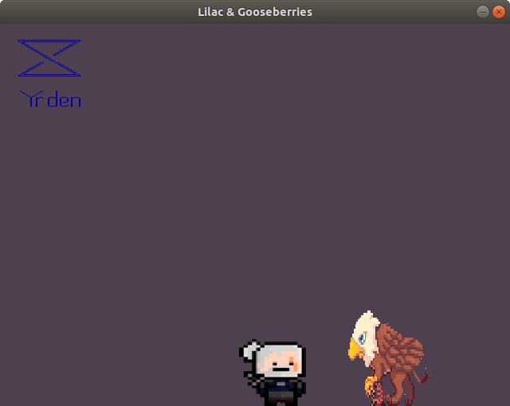

<h2>endless runner (witcher themed)</h2>

Software: C++ and Simple DirectMedia Layer libraries (https://www.libsdl.org/)

apt-get install libsdl2-dev libsdl2-image-dev libsdl2-ttf-dev libsdl2-mixer-dev

Assets: https://www.pixilart.com/pix-man
	https://www.deviantart.com/x-naku-x

**Disclaimer**: The game is in its 'proof of concept' stage. It's a simple endless runner with basic mechanics like jumping and picking up items.

**Screenshots**:

**Instructions**: Press the spacebar to jump. Press 1, 2 to select a sign.

**Walkthrough**: Collect power-ups (lilac, gooseberries, oils, potions and other special items). Avoid enemies by jumping over them.
