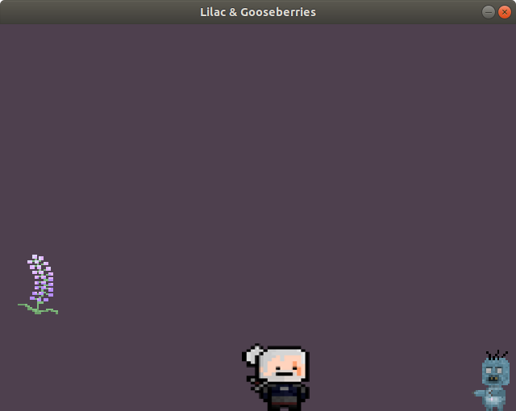

<h2>endless runner (witcher themed)</h2>

Software: C++ and Simple DirectMedia Layer libraries (https://www.libsdl.org/)

Assets: https://www.pixilart.com/pix-man
	https://www.deviantart.com/x-naku-x

**Disclaimer**: The game is in its 'proof of concept' stage.

**Screenshots**:

**Instructions**: Use space to jump.

**Walkthrough**: Collect power-ups (lilac, gooseberries, oils, potions and other special items). Avoid enemies by jumping over them. 
